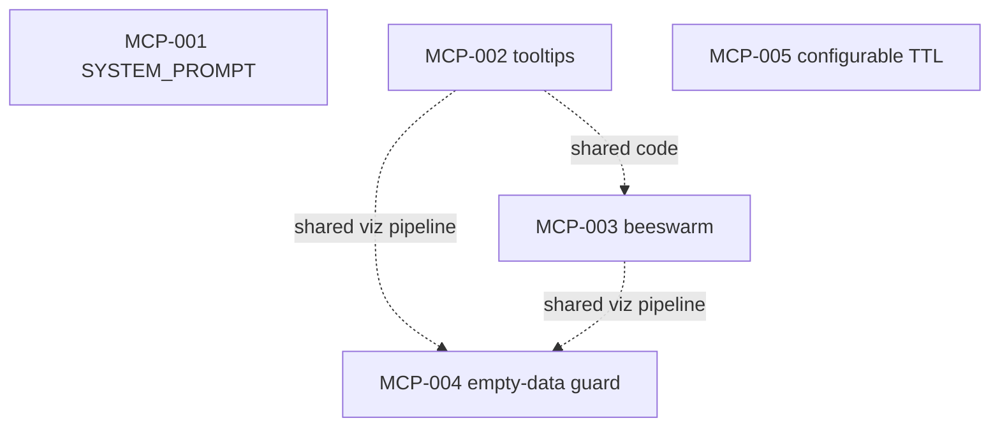

# data360-mcp — task index

Agent-oriented work items for visualization and MCP `SYSTEM_PROMPT` alignment with the Data AI Chatbot backlog.

**Sibling repo (same parent folder as this repo):** [vercel-ai-chatbot/TODO](../../vercel-ai-chatbot/TODO/README.md)

## Task IDs

| ID | File | Summary |
|----|------|---------|
| MCP-001 | [MCP-001-system-prompt-sync.md](./MCP-001-system-prompt-sync.md) | Mirror Writer/Planner-facing rules into `SYSTEM_PROMPT` (`src/data360/mcp_server/prompts.py`) |
| MCP-002 | [MCP-002-vega-line-tooltips.md](./MCP-002-vega-line-tooltips.md) | Default Vega-Lite tooltips for line/area (and similar) in generated specs |
| MCP-003 | [MCP-003-beeswarm-multi-country.md](./MCP-003-beeswarm-multi-country.md) | High series cardinality → strip/beeswarm (or facet) instead of unreadable line clutter |
| MCP-004 | [MCP-004-viz-empty-data-guard.md](./MCP-004-viz-empty-data-guard.md) | Guard `generate_vega_spec()` against empty `data` list (KeyError crash) |
| MCP-005 | [MCP-005-cache-configurable-ttl.md](./MCP-005-cache-configurable-ttl.md) | Make cache TTL configurable via `MCP_CACHE_TTL` env var (default 300 s) |

## Dependency graph (this repo)

**Note:** MCP-002 → MCP-003 is a **soft** ordering (shared viz pipeline); MCP-001 is independent of MCP-002/003 but should follow chatbot **BE-001** for content sync.

## Cross-repo

See [CROSS-REPO-GRAPH.md](./CROSS-REPO-GRAPH.md) (mirrors vercel-ai-chatbot’s graph for MCP edges).

## How to use

1. Point an agent at this folder or a single `MCP-*.md`.
2. **MCP-001** should be coordinated with `vercel-ai-chatbot/TODO/BE-001-writer-planner-prompts.md`.
3. Update task `status` in frontmatter when done.
