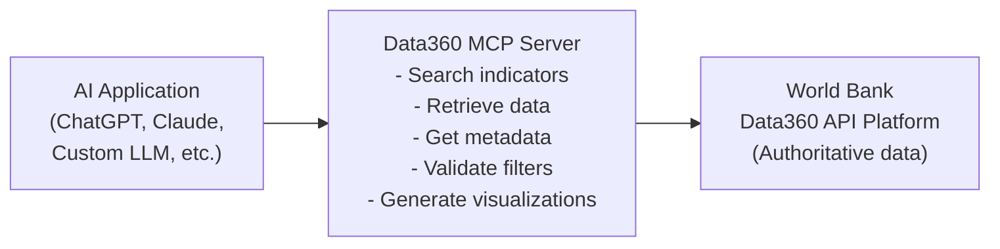
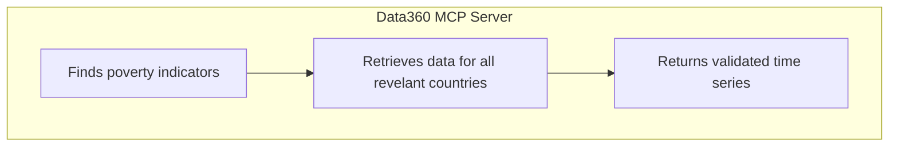
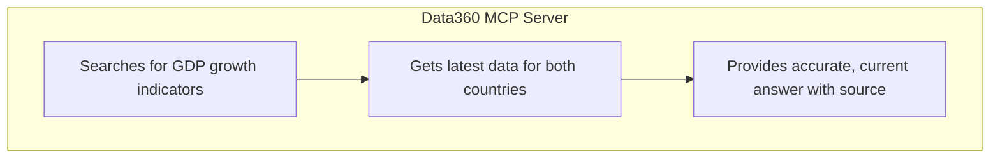

# What is Data360 MCP?

## The Problem

Large Language Models have emerged as a powerful tool for data retrieval, yet they have a critical limitation when working with real-world data because they can generate fabricated statistics and indicators (also known as "hallucinations").

As a result, asking an AI application for economic or development data may yield answers that sound plausible but are entirely false. For economists, researchers and data practitioners, maintaining access to accurate, current and reliable information is critical.

## The Solution: Data360 MCP Server

The **Data360 MCP Server** is the official implementation built on the [Model Context Protocol](https://modelcontextprotocol.io/docs/getting-started/intro), an open-source standard for connecting AI applications. It provides programmatic access to the [World Bank Data360](https://data360.worldbank.org/en/about) data platform, covering up to 300 data points across the World Bank Group and partners.

By accessing verified and authoritative data directly, it enables AI agents and applications to:

- ✅ Search for economic indicators without relying on unverified or hallucinated data
- ✅ Retrieve development indicators with proper filtering by country, year and dimensions
- ✅ Access metadata about available data
- ✅ Generate plots specifications for data visualiation
- ✅ Handle missing or incomplete data gracefully

## Key Advantages

| Aspect | Without Data360 MCP | With Data360 MCP |
| -------- | ------------ | ------------------ |
| **Accuracy** | LLM hallucinations | Authoritative World Bank data |
| **Freshness** | Training data cutoff | Current API updates |
| **Precision** | Approximate answers | Exact filtered data |
| **Reliability** | Varies by model | Consistent, documented |
| **Traceability** | No clear source | Direct API reference |

### How It Works

Data360 MCP Server acts as a middleware layer between LLMs and the World Bank Data360 API. It translates natural language requests into structured data queries—and returns clean, validated results.

## Use Cases

### Research & Analysis

> Economist: "What are the poverty trends in Sub-Saharan Africa over the last decade?"

### 2. AI-Powered Chat

> User: "How did Kenya's economic growth compare to Tanzania in 2023?"

### 3. Development Applications

> NGO Platform: Uses Data360 MCP to display development metrics on dashboards and reports

### 4. Academic Research

> Researcher: Integrates Data360 with research tools to fetch historical data for econometric studies without manual downloads
